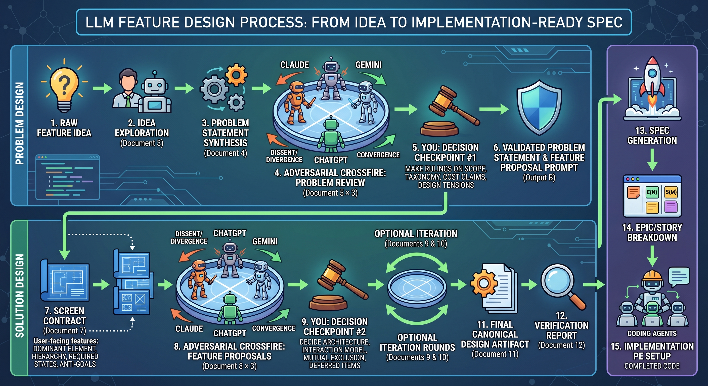

# Feature Design Templates

A structured, adversarial multi-model workflow for taking a feature from a raw idea to implementation-ready epics, stories, and an execution handoff.



## What This Repo Contains

This repo is **both** a set of standalone prompt templates **and** a Claude plugin that wraps them into slash commands.

- **15 numbered prompt templates** — usable independently in any LLM. One process guide plus fourteen prompts covering discovery, adversarial review, synthesis, verification, spec generation, and implementation setup.
- **A Claude plugin (`fd`)** — slash commands and a discovery skill that automate triage, exploration, problem statement, UI contract, verification, spec, epics, and PE setup. State is tracked per-feature in a session folder.

The method is best suited to products that already have canonical source docs, a human decision-maker who will make explicit rulings, and a willingness to run multiple independent LLM sessions in parallel.

## Use As a Claude Plugin

The plugin runs the in-scope stages of the pipeline (everything except crossfire, deferred for now) as slash commands.

### Install

This repo is a self-contained plugin — install it as a local plugin in Claude Code or Cowork mode. Once installed, all commands are namespaced under `/feature-design:`.

### Quick start

```
/feature-design:start <feature-name> -- <one-line idea>
/feature-design:next      # walks the rest of the pipeline; hard-gates prerequisites
/feature-design:status    # snapshot of the active session
```

### Pipeline (full)

| Command | Wraps template | Output |
|---|---|---|
| `/feature-design:triage` | 02 | `01-triage.md` |
| `/feature-design:explore` | 03 | `02-exploration.md` (interactive) |
| `/feature-design:problem` | 04 | `03-problem-statement.md` |
| `/feature-design:problem-crossfire` | 05 | `05a-claude.md`, `05b-codex.md`, `05c-gemini.md` |
| `/feature-design:problem-decision` | 06 | `06-validated-problem.md`, `06-feature-proposal-source.md` |
| `/feature-design:ui-draft` | 07 | `04-ui-contract.md` (user-facing only) |
| `/feature-design:proposal-crossfire` | 08 | `08a-claude.md`, `08b-codex.md`, `08c-gemini.md` |
| `/feature-design:proposal-synthesis` | 09 | `09-round{N}-synthesis.md` (re-runnable per round) |
| `/feature-design:proposal-iterate` | 10 | `10a-round{N}-claude.md`, `10b-round{N}-codex.md`, `10c-round{N}-gemini.md` |
| `/feature-design:proposal-final` | 11 | `11-final-design.md` (canonical design — locked) |
| `/feature-design:verify` | 12 | `07-verification.md` |
| `/feature-design:spec` | 13 | `08-spec.md` |
| `/feature-design:epics` | 14 | `09-epics.md` |
| `/feature-design:pe-setup` | 15 | `10-pe-prompt.md` |

Sessions live in `.feature-design/<slug>/` in your working folder.

The orchestrator (`/feature-design:next`) hard-gates progression — it refuses to advance if a prerequisite stage hasn't completed. Pass `--force` to override deliberately.

**Crossfire iteration loop:** after `/feature-design:proposal-synthesis` completes, `/feature-design:next` stops and asks you to choose: another adversarial round (`/feature-design:proposal-iterate`, then `/feature-design:proposal-synthesis` again) or finalize (`/feature-design:proposal-final`). The convergence signal in the synthesis report tells you whether iterating again is likely worth the cost.

**Crossfire dispatch — internal vs. external:** the three crossfire dispatch commands (`/feature-design:problem-crossfire`, `/feature-design:proposal-crossfire`, `/feature-design:proposal-iterate`) support two modes:

- **Internal:** plugin invokes Claude (via `claude-cli` skill), Codex (via `codex` skill), Gemini (via `gemini` skill) sequentially from the project working directory. Default.
- **External:** plugin saves the substituted crossfire prompt to disk and waits for you to run it through your own crossfire tool, then drops the three response files into the session folder. Useful if you have a dedicated crossfire system that does this better than three sequential CLI shellouts.

Mode is set per-session at `/feature-design:start` time (`state.crossfire.dispatch_mode`) and can be overridden per-command with `--external` or `--internal`. Synthesis and decision commands (`/feature-design:problem-decision`, `/feature-design:proposal-synthesis`, `/feature-design:proposal-final`) work identically regardless of dispatch mode — they just read the response files from the session folder.

**Crossfire reviewers read files from your repo.** Crossfire prompts reference files by relative path (`docs/PRD.md`, `.feature-design/<slug>/03-problem-statement.md`, etc.). The dispatched models read those files via their CLI's filesystem tools (Codex via `--sandbox read-only`, Gemini natively, Claude via `--allowed-tools "Read,Glob,Grep,WebFetch"`). Internal dispatch runs from the project working directory so paths resolve correctly. **The plugin does not inline file contents into prompts** — that would defeat the file-access affordance and reduce crossfire to "respond to whatever the moderator pasted."

**Crossfire response threshold.** Crossfire's signal comes primarily from convergence between independent perspectives. Empirically, two independent reviewers capture roughly 90% of the convergence signal; the third reviewer's value is diversity of thought (different training corpora, different reasoning style) rather than statistical reliability. So the policy isn't strict 3/3 — it's:

- **3/3 succeeded** → proceed normally.
- **2/3 succeeded** → dispatch command stops and prompts the user. Choices: retry the failed model, run it externally (the prompt is saved to `.crossfire-prompts/<stage>.md`), or proceed with 2/3 acknowledging the diversity tradeoff. Pass `--allow-partial` to skip the prompt and proceed silently. The synthesis output gets a "produced from 2 of 3" annotation that flows downstream.
- **1/3 succeeded** → hard fail. Single-perspective review isn't crossfire — there's nothing for synthesis to converge against.
- **0/3 succeeded** → hard fail. Suggests switching to `--external` for the stage.

When a model fails, the plugin writes a retry stub to that response file containing the prompt path and the list of files the reviewer needs to read. The user can fix the failure and re-dispatch, or run that one model manually and overwrite the stub.

**External dispatch supports two response shapes.** When you run crossfire externally and bring responses back, the plugin accepts either:

- **Three separate files**, one per model, matching the `<NN>[abc]-*.md` pattern (e.g., `05a-claude.md`, `05b-codex.md`, `05c-gemini.md`).
- **A single combined file** containing all responses, matching `<NN>-*.md` without the `a/b/c` letter suffix (e.g., `05-crossfire.md`). Useful when your crossfire tool produces one output document. The plugin asks how many perspectives the file contains and applies the same threshold policy.

Synthesis stages handle either shape. The plugin doesn't care where the responses came from — only that the threshold is met.

### Multi-model skills

The plugin also ships three skills that let Cowork Claude shell out to other model CLIs for independent perspectives. They're foundation pieces for the still-deferred crossfire stages, but they're independently usable today for any "second-opinion" task.

| Skill | What it does | CLI it wraps |
|---|---|---|
| `codex` | Invoke OpenAI Codex CLI for an independent OpenAI-side response | `codex exec` |
| `gemini` | Invoke Google Gemini CLI for an independent Google-side response | `gemini -p` |
| `claude-cli` | Spawn a fresh-context Claude session, separate from the moderator | `claude -p` from a scratch directory |

Each skill checks whether its CLI is installed before calling, fails fast with a clear setup message if not, and documents the auth model the user needs (OAuth-friendly where possible — `claude-cli` deliberately avoids `--bare` so subscription auth keeps working).

The moderator (Cowork Claude) doesn't participate in crossfire reviews itself — that would contaminate the adversarial signal. It coordinates and synthesizes. The three skills give it the three independent perspectives crossfire requires.

### Connectors

The plugin declares a set of MCP servers in `.mcp.json` and uses `~~category` placeholders in command files (the same pattern Anthropic's productivity plugin uses) so it works with whatever connectors you have authenticated.

| Category | Placeholder | Bundled options | Used by |
|---|---|---|---|
| Project tracker | `~~project tracker` | Linear, Asana, Atlassian, Monday, ClickUp | `/feature-design:epics` (optional push), `/feature-design:status` (live issue states) |
| Code repo | `~~code repo` | GitHub | `/feature-design:epics` (file-path grounding) |
| Knowledge base | `~~knowledge base` | Notion | Optional supplementary doc lookups |
| Drive / file store | `~~drive` | Google Drive (user-installed) | Optional — `/feature-design:explore`, `/feature-design:problem` for customer feedback / samples |

Authenticate connectors via `/mcp` after the plugin is enabled. You only need to authenticate the ones you actually use. See [`CONNECTORS.md`](./CONNECTORS.md) for the full per-command behavior.

**Note on Google Drive:** there's no canonical Anthropic-hosted Drive MCP server, so this plugin doesn't bundle one. If you have a Drive connector installed via Cowork or another path, the `~~drive` placeholder will resolve to it. If not, commands fall back to local-files-only behavior.


## What This Is Not

- **Not an agile story-decomposition tool.** If you already have accepted requirements and just need stories, skip to Document 14.
- **Not a replacement for user research.** There are no real users in this loop — the adversarial pressure comes from models, not humans.
- **Not a single-LLM prompt-tuning framework.** The core value comes from comparing *independent* outputs across three different frontier models. One model with a clever prompt does not produce the same signal.
- **Not a PRD substitute.** You need canonical source docs (PRD, architecture notes, design principles) *before* Document 2 can triage anything.

## Companion Repo

Same underlying idea — *the way you structure AI changes the quality of thinking you get back* — applied at a different layer:

- **[LLM Directive Framework](https://github.com/choughton/llm-directive-framework)** — tune *one* model for sharper, less sycophantic output
- **This repo** — run structured adversarial design pressure across *multiple* models

## Read This First

Start with [`01 - FEATURE_DESIGN_PROCESS.md`](./01%20-%20FEATURE_DESIGN_PROCESS.md).

That document is the operating guide for:

- when to run the full pipeline vs. use shortcuts
- which templates share a chat and which require fresh chats
- what the human must decide at each checkpoint
- how to move from design artifacts into spec, epics, and implementation

## Pipeline Overview

```text
Triage
  -> Idea Exploration
  -> Problem Statement Synthesis
  -> Problem Statement Crossfire
  -> Decision Checkpoint #1
  -> Problem Statement Decision Synthesis
  -> UI Drafting Brief / Screen Contract (user-facing features only)
  -> Feature Proposal Crossfire
  -> Decision Checkpoint #2
  -> Round N Synthesis
  -> Optional Round N+1 Crossfire loops
  -> Final Decision Synthesis
  -> Verification
  -> Spec Generation
  -> Epic / Story Breakdown
  -> Implementation PE Setup
```

## Entry Modes

Not every feature should start at Document 2 and run the full pipeline.

### Full pipeline (Documents 2-15)

Use the full workflow when:

- the feature introduces a new interaction pattern
- the design has significant open questions
- the feature crosses multiple system boundaries
- a bad design would have downstream cost
- you have a hunch or a half-formed idea rather than a settled requirement

### Spec-only shortcut (Documents 13-14)

Skip directly to spec generation and breakdown when:

- the feature is already well-specified in your canonical docs
- the remaining questions are implementation-level, not product-level
- triage confirms the design is already fully covered

### Mid-pipeline starts

Start at a later document when:

- the **problem is clear but the solution is open** -> start at problem-statement crossfire
- the **problem and solution direction are clear but need validation** -> start at feature-proposal crossfire

## Cost & Time Expectations

A full-pipeline run is not cheap and it is not fast. Calibrate before you start.

- **LLM sessions:** ~12-18 distinct chat sessions for a single feature when the pipeline runs end-to-end (three crossfire rounds × three models, plus moderator, synthesis, verification, spec, epics, and PE chats). Each iterative crossfire loop adds three more sessions.
- **Human decision time:** Budget **several hours** across two non-trivial decision checkpoints, plus review time for each crossfire response set. This is not background work — the rulings are the product.
- **Calendar time:** A single feature typically spans multiple sittings. Treat it as a multi-day process, not an afternoon.
- **When to scale down:** Use the **Spec-only shortcut** or a **mid-pipeline start** whenever triage (Document 2) confirms the design is already covered or the open questions are narrow. Running the full pipeline on a small feature is waste.

## Quick Start

1. Open the process guide (`01`) and choose your entry mode.
2. Fill the `{{PLACEHOLDER}}` fields in the relevant template(s).
3. Run prompts in the correct chat/session boundaries.
4. At each decision checkpoint, make explicit numbered rulings yourself.
5. Carry the resulting artifacts forward into verification, spec generation, and implementation setup.

## Chat / Session Map

The workflow is intentionally split across separate chats so synthesis steps do not inherit the wrong context.

| Chat | Documents | Purpose |
|---|---|---|
| **Chat A** | 2 -> 3 -> 4 -> 6 -> 7 | Moderator chat from triage through decision synthesis and optional Screen Contract drafting |
| **Chat B** | 5 | Problem-statement crossfire: 3 separate LLM chats using the same source document (ideally different frontier models like Claude, ChatGPT, Gemini for best adversarial divergence) |
| **Chat C** | 9, 11 | Reconciliation and final synthesis after proposal crossfire |
| **Chat D** | 8 | Initial feature-proposal crossfire: 3 separate LLM chats (ideally different frontier models) |
| **Chat D'** | 10 | Optional iterative crossfire rounds: 3 fresh chats per round (ideally different frontier models) |
| **Chat E** | 12 | Independent verification chat |
| **Chat F** | 13 -> 14 | Spec generation and epic/story decomposition |
| **Chat G** | 15 | Persistent implementation PE chat that stays open during execution |

## Human Role: Decision-Maker, Not Reviewer

This process only works if the human makes explicit rulings.

There are two core decision checkpoints:

- **Checkpoint #1:** after problem-statement crossfire
- **Checkpoint #2:** after feature-p